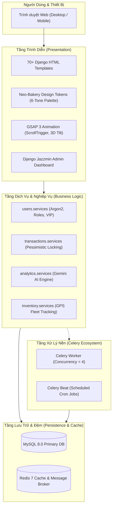
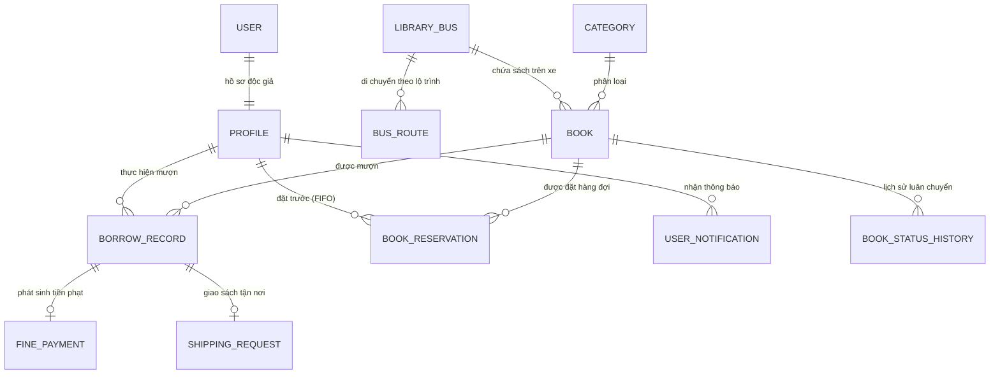

# 📚 Cấu Trúc Dự Án — Tủ Sách Lưu Động (Library Bus System)
> **Phiên bản:** 2.0.0  
> **Kiến trúc:** Django High-Performance Modular Monolith  
> **Đường dẫn dự án:** `C:\Users\ADMIN\Documents\prj`  
> **Ngày cập nhật:** 2026-09-03  

---

## 📑 Mục Lục
1. [Tổng Quan Dự Án & Công Nghệ (Tech Stack)](#1-tổng-quan-dự-án--công-nghệ-tech-stack)
2. [Sơ Đồ Cây Thư Mục Toàn Diện (Directory Tree)](#2-sơ-đồ-cây-thư-mục-toàn-diện-directory-tree)
3. [Phân Tích Chi Tiết 7 Phân Hệ Nghiệp Vụ (Django Apps)](#3-phân-tích-chi-tiết-7-phân-hệ-nghiệp-vụ-django-apps)
4. [Sơ Đồ Kiến Trúc & Quan Hệ Dữ Liệu (Mermaid Diagrams)](#4-sơ-đồ-kiến-trúc--quan-hệ-dữ-liệu-mermaid-diagrams)
5. [Hệ Thống Giao Diện & Design System (Neo-Bakery & GSAP)](#5-hệ-thống-giao-diện--design-system-neo-bakery--gsap)
6. [Hạ Tầng, Container & Tác Vụ Bất Đồng Bộ (DevOps & Celery)](#6-hạ-tầng-container--tác-vụ-bất-đồng-bộ-devops--celery)
7. [Bộ Kịch Bản Quản Trị & Kiểm Thử (Admin Scripts & Testing)](#7-bộ-kịch-bản-quản-trị--kiểm-thử-admin-scripts--testing)

---

## 1. Tổng Quan Dự Án & Công Nghệ (Tech Stack)

Dự án **Tủ Sách Lưu Động (Library Bus System)** là nền tảng số hóa kết hợp mạng lưới các xe buýt thư viện lưu động thực tế, giúp mang sách đến trường học, khu đô thị, vùng nông thôn và phục vụ bạn đọc yêu sách.

### Thông Số Kỹ Thuật:
- **Ngôn ngữ & Framework:** Python 3.11 / 3.12, Django 5.2.4 (Modular Monolith)
- **Cơ sở dữ liệu:** MySQL 8.0 (`mysqlclient==2.2.7`)
- **Bộ nhớ đệm (Cache):** Redis 7 (`django-redis==6.0.0`, `hiredis==3.4.0`)
- **Hàng đợi tác vụ bất đồng bộ:** Celery 5.5.3 + Celery Beat + Redis Broker
- **Trí tuệ nhân tạo (AI):** Google Gemini AI (`google-generativeai==0.8.5`)
- **Bảo mật xác thực:** Thuật toán băm mật khẩu Argon2 (`argon2-cffi==25.1.0`)
- **Giao diện & Hoạt cảnh:** Django Templates (70+ file), Neo-Bakery 6-Tone Tokens, GSAP 3.x (ScrollTrigger, 3D Tilt)
- **Container hóa:** Docker Multi-stage, Docker Compose 5 dịch vụ (`web`, `db`, `redis`, `celery_worker`, `celery_beat`)

---

## 2. Sơ Đồ Cây Thư Mục Toàn Diện (Directory Tree)

```text
C:\Users\ADMIN\Documents\prj/
│
├── .agents/                                # Định nghĩa Agentic Skills của hệ thống
│   └── skills/
│       ├── gsap/                           # Quy chuẩn hoạt cảnh GSAP 60 FPS compositor-only
│       └── impeccable/                     # Bộ nguyên tắc thiết kế Impeccable Design System
│
├── .github/
│   └── workflows/
│       └── ci.yml                          # CI Pipeline linting, audit bảo mật & test tự động
│
├── library_bus_project/                    # THƯ MỤC MÃ NGUỒN CHÍNH (DJANGO APP ROOT)
│   │
│   ├── analytics/                          # [APP] Phân tích thói quen đọc sách & AI Recommender
│   │   ├── migrations/                     # Lược đồ database cho analytics
│   │   ├── admin.py                        # Quản trị dữ liệu phân tích trong Django Admin
│   │   ├── apps.py                         # Khai báo AppConfig
│   │   ├── models.py                       # UserReadingStats, BookAnalytics, BusAnalytics, DailyStats...
│   │   ├── tasks.py                        # Celery tasks tổng hợp dữ liệu định kỳ & xóa log cũ
│   │   ├── tests.py                        # Bộ kiểm thử cho analytics
│   │   ├── urls.py                         # Routing: Dashboard phân tích, Leaderboard, Export
│   │   └── views.py                        # Logic thống kê & trả dữ liệu biểu đồ
│   │
│   ├── blog/                               # [APP] Tin tức, cổng truyền thông & đánh giá sách
│   │   ├── migrations/                     # 7 file migrations
│   │   ├── admin.py                        # Quản trị bài viết, danh mục, bình luận, tag, báo cáo
│   │   ├── apps.py                         # AppConfig Blog
│   │   ├── forms.py                        # Form bình luận, đánh giá, đăng ký bản tin
│   │   ├── models.py                       # Post, BlogCategory, BlogTag, PostRating, Comment, Newsletter
│   │   ├── signals.py                      # Tự động tính lượt xem, cập nhật rating trung bình
│   │   ├── tasks.py                        # Tác vụ gửi bản tin email định kỳ
│   │   ├── tests.py                        # Test suite cho blog
│   │   ├── urls.py                         # Routing: Danh sách bài viết, chi tiết, tag, danh mục
│   │   └── views.py                        # Logic hiển thị tin tức, tìm kiếm & bình luận
│   │
│   ├── core/                               # [APP] Nền tảng chia sẻ hạ tầng (Shared Infrastructure)
│   │   ├── admin.py                        # Cấu hình base admin
│   │   ├── apps.py                         # AppConfig Core
│   │   ├── models.py                       # TimestampedModel, SoftDeleteModel, AuditMixin, BaseQuerySet
│   │   ├── tasks.py                        # Tác vụ nền dọn dẹp file tạm
│   │   ├── tests.py                        # Kiểm thử base models & managers
│   │   └── views.py                        # Custom error handlers (400, 403, 404, 500)
│   │
│   ├── inventory/                          # [APP] Kho sách, đội xe buýt & trạm dừng định vị GPS
│   │   ├── migrations/                     # 7 file migrations
│   │   ├── admin.py                        # Quản trị kho sách, xe buýt, lộ trình GPS, quyên góp
│   │   ├── apps.py                         # AppConfig Inventory
│   │   ├── forms.py                        # Form quyên góp sách, bộ lọc sách nâng cao
│   │   ├── models.py                       # LibraryBus, BusRoute, Category, Book, BookDonation...
│   │   ├── tests.py                        # Test suite kiểm kê kho & route xe buýt
│   │   ├── urls.py                         # Routing: Tra cứu sách, chi tiết, bản đồ lộ trình, đọc PDF
│   │   └── views.py                        # Views danh mục sách, bản đồ GPS, PDF viewer
│   │
│   ├── library_bus_project/                # [CONFIG] Cấu hình trung tâm Django
│   │   ├── __init__.py                     # Khởi tạo Celery app cùng Django
│   │   ├── asgi.py                         # Cổng kết nối ASGI (WebSockets / Async)
│   │   ├── celery.py                       # Khai báo Celery instance & beat schedule
│   │   ├── settings.py                     # Toàn bộ cấu hình: Database, Cache, Auth, Middleware
│   │   ├── urls.py                         # Root routing kết nối toàn bộ 7 apps
│   │   └── wsgi.py                         # Cổng kết nối WSGI cho Gunicorn/Waitress
│   │
│   ├── notifications/                      # [APP] Hệ thống thông báo đa kênh (In-app & Email)
│   │   ├── migrations/                     # 3 file migrations
│   │   ├── admin.py                        # Quản lý thông báo người dùng
│   │   ├── apps.py                         # AppConfig Notifications
│   │   ├── context_processors.py           # Tiêm badge đếm số thông báo chưa đọc vào mọi template
│   │   ├── models.py                       # Model UserNotification
│   │   ├── tasks.py                        # Celery tasks gửi email nhắc hẹn trả sách, thông báo sự kiện
│   │   ├── tests.py                        # Kiểm thử hệ thống thông báo
│   │   ├── urls.py                         # Routing: Xem danh sách thông báo, đánh dấu đã đọc
│   │   └── views.py                        # Views & API cập nhật trạng thái thông báo
│   │
│   ├── transactions/                       # [APP] Mượn trả sách, hàng đợi đặt trước & phạt trễ
│   │   ├── migrations/                     # 2 file migrations
│   │   ├── admin.py                        # Quản trị phiếu mượn, yêu cầu giao sách, xử lý tiền phạt
│   │   ├── apps.py                         # AppConfig Transactions
│   │   ├── forms.py                        # Form mượn sách, form đặt trước, thanh toán phạt
│   │   ├── models.py                       # BorrowRecord, BookReservation, ShippingRequest, FinePayment
│   │   ├── services.py                     # Chứa Service Layer: Khóa bi quan select_for_update chống race condition
│   │   ├── tasks.py                        # Celery tasks quét sách quá hạn nửa đêm, tính nợ phạt
│   │   ├── tests.py                        # Test suite quy trình mượn trả & giao nhận
│   │   ├── urls.py                         # Routing: Mượn sách, gia hạn, hủy đặt trước, thanh toán
│   │   └── views.py                        # Views xử lý mượn trả, checkout, hàng đợi
│   │
│   ├── users/                              # [APP] Hồ sơ độc giả, phân quyền vai trò & thẻ hội viên
│   │   ├── migrations/                     # 4 file migrations
│   │   ├── templatetags/                   # Custom filters: user_extras.py
│   │   ├── admin.py                        # Quản trị người dùng, phân cấp thẻ VIP, phân quyền
│   │   ├── apps.py                         # AppConfig Users
│   │   ├── forms.py                        # Forms đăng nhập, đăng ký, chỉnh sửa hồ sơ, đổi mật khẩu
│   │   ├── models.py                       # Profile, UserInterest, LoginHistory, UserPreference
│   │   ├── tests.py                        # Kiểm thử xác thực Argon2 & phân quyền
│   │   ├── urls.py                         # Routing: Auth, Profile, Membership VIP, Login history
│   │   ├── utils.py                        # Tiện ích token, bảo mật & định dạng số điện thoại
│   │   └── views.py                        # Views đăng ký, đăng nhập, nâng cấp thẻ
│   │
│   ├── logs/                               # Thư mục ghi log vận hành hệ thống (app.log, celery.log)
│   │
│   ├── media/                              # Tệp tin người dùng tải lên (User Uploads)
│   │   ├── avatars/                        # Ảnh đại diện độc giả
│   │   ├── book_covers/                    # Hơn 270 ảnh bìa sách trong kho
│   │   └── book_pdfs/                      # Tài liệu sách điện tử định dạng PDF
│   │
│   ├── scripts/                            # Bộ kịch bản bảo trì & kiểm định hệ thống
│   │   ├── deep_template_audit.py          # Kiểm toán cấu trúc toàn bộ 70+ template HTML
│   │   ├── optimize_images.py              # Tự động nén WebP và điều chỉnh kích thước ảnh bìa sách
│   │   ├── populate_books.py               # Gieo dữ liệu kho sách mẫu
│   │   ├── seed_routes.py                  # Khởi tạo lộ trình và tọa độ GPS các điểm dừng xe
│   │   ├── taste_preflight_check.py        # Kiểm định tuân thủ Design Tokens Neo-Bakery
│   │   └── test_race_condition.py          # Mô phỏng mượn sách đồng thời kiểm tra cơ chế khóa
│   │
│   ├── static/                             # Tài nguyên tĩnh (CSS, JS, Hình ảnh)
│   │   ├── css/
│   │   │   ├── admin_premium.css           # Giao diện Django Admin cao cấp
│   │   │   ├── animations.css              # Keyframe CSS animations
│   │   │   ├── base.css                    # CSS cơ sở, bố cục lưới và reset
│   │   │   ├── components.css              # Thư viện component: Button, Modal, Card...
│   │   │   └── tokens.css                  # Bảng mã màu 6 tông Neo-Bakery & CSS Variables
│   │   ├── js/
│   │   │   └── animations.js               # Khởi tạo GSAP ScrollTrigger & 3D micro-tilt physics
│   │   ├── analytics/                      # CSS/JS cho bảng điều khiển thống kê
│   │   ├── blog/                           # CSS/JS cho cổng blog
│   │   └── img/                            # Logo, icon, placeholder
│   │
│   ├── template/                           # Hệ thống hơn 70 giao diện HTML (Django Templates)
│   │   ├── analytics/                      # 11 templates bảng điều khiển, biểu đồ, leaderboard
│   │   ├── blog/                           # 14 templates bài viết, danh mục, bình luận, newsletter
│   │   ├── inventory/                      # 22 templates catalog, xe buýt, trạm dừng, PDF viewer
│   │   ├── notifications/                  # 3 templates danh sách và chi tiết thông báo
│   │   ├── pages/                          # 6 templates tĩnh: Trang chủ, Giới thiệu, FAQ, Điều khoản
│   │   ├── partials/                       # Các component tái sử dụng (Phân trang, Header, Footer)
│   │   ├── transactions/                   # 10 templates phiếu mượn, hàng đợi, nộp phạt
│   │   └── users/                          # 14 templates đăng nhập, hồ sơ, đổi mật khẩu, VIP
│   │
│   ├── .env                                # Biến môi trường cục bộ (Database, Secret, API keys)
│   ├── .env.example                        # File mẫu biến môi trường chuẩn
│   ├── functional_test.py                  # Kiểm thử chức năng toàn diện (E2E)
│   ├── generate_blog_data.py               # Tạo dữ liệu giả lập cho bài viết Blog
│   ├── generate_test_data.py               # Tạo dữ liệu giả lập cho hệ thống
│   ├── manage.py                           # Điểm điều khiển CLI của Django
│   ├── run_server.py                       # Script khởi động nhanh server
│   └── seed_books.py                       # Kịch bản nạp sách mẫu ban đầu
│
├── .dockerignore                           # Danh sách loại trừ khi đóng gói Docker
├── .gitignore                              # Danh sách bỏ qua phiên bản Git
├── DESIGN.md                               # Đặc tả Design Tokens Neo-Bakery (Bảng màu, Font, Shadows)
├── docker-compose.yml                      # Điều phối 5 Container: Web, MySQL, Redis, Worker, Beat
├── Dockerfile                              # Quy trình đóng gói ứng dụng Python/Django vào container
├── PRODUCT.md                              # Đặc tả sản phẩm, chân dung người dùng & triết lý thương hiệu
├── pyproject.toml                          # Cấu hình Metadata dự án theo chuẩn PEP 518/621
├── README.md                               # Tài liệu giới thiệu dự án & hướng dẫn cài đặt
├── requirements.txt                        # Danh sách thư viện Python Production cố định phiên bản
├── requirements-dev.txt                    # Danh sách thư viện môi trường phát triển & kiểm thử
└── website.pdf                             # Bản in portfolio thiết kế website
```

---

## 3. Phân Tích Chi Tiết 7 Phân Hệ Nghiệp Vụ (Django Apps)

Mỗi ứng dụng trong `library_bus_project/` giải quyết trọn vẹn một miền nghiệp vụ độc lập:

| Phân Hệ (App) | Trọng Trách Nghiệp Vụ | Các Models Trọng Yếu | Tác Vụ Nền (Celery) |
| :--- | :--- | :--- | :--- |
| **`core`** | Nền tảng hạ tầng chia sẻ: Audit tracking, Soft delete, versioned cache mixins. | `AuditMixin`, `BaseQuerySet`, `TimestampedModel`, `SoftDeleteModel` | Quét dọn file tạm hệ thống |
| **`users`** | Quản lý độc giả, nhân viên, cơ chế thẻ VIP, bảo mật xác thực Argon2. | `Profile`, `UserInterest`, `LoginHistory`, `UserPreference`, `UserRole` | Gửi mail kích hoạt, đặt lại mật khẩu |
| **`inventory`** | Quản lý kho sách, đội xe buýt, lộ trình trạm dừng GPS, quyên góp & PDF viewer. | `LibraryBus`, `BusRoute`, `Category`, `Book`, `BookStatusHistory`, `BookDonation` | Trích xuất metadata sách bằng Gemini AI |
| **`transactions`** | Mượn trả sách, hàng đợi đặt trước (FIFO queue), cơ chế khóa chống race condition, nộp phạt. | `BorrowRecord`, `BookReservation`, `ShippingRequest`, `FinePayment`, `BulkTransaction` | Quét sách quá hạn lúc nửa đêm, tính nợ phạt |
| **`analytics`** | Tổng hợp số liệu đọc, bảng vàng độc giả (Leaderboard), đánh giá hiệu suất tuyến xe. | `UserReadingStats`, `BookAnalytics`, `BusAnalytics`, `UserActivity`, `BookRecommendation` | Tổng hợp bảng xếp hạng tuần/tháng, gợi ý AI |
| **`notifications`** | Thông báo đẩy nội bộ (In-app badges) và gửi email tự động. | `UserNotification` | Gửi email hàng loạt thông báo lịch trình xe |
| **`blog`** | Cổng thông tin, tin tức, đánh giá sách, tương tác cộng đồng & newsletter. | `Post`, `BlogCategory`, `BlogTag`, `PostRating`, `Comment`, `Newsletter` | Gửi bản tin định kỳ cho người đăng ký |

---

## 4. Sơ Đồ Kiến Trúc & Quan Hệ Dữ Liệu (Mermaid Diagrams)

### 4.1. Kiến Trúc Phân Tầng Hệ Thống (Layered Architecture)



### 4.2. Sơ Đồ Thực Thể Quan Hệ Cốt Lõi (Entity Relationship Diagram)



---

## 5. Hệ Thống Giao Diện & Design System (Neo-Bakery & GSAP)

Hệ thống áp dụng ngôn ngữ thiết kế **Neo-Bakery & Classic Library** dựa trên [`DESIGN.md`](file:///C:/Users/ADMIN/Documents/prj/DESIGN.md):

### 5.1. Bảng Màu 6 Sắc Thái Cốt Lõi (6-Tone Palette):
1. **`#4E0705` (Molasses):** Mật mía đậm, màu mực gỗ gụ sẫm, dùng cho chữ hiển thị chính và nền tối.
2. **`#812203` (Well-Browned):** Màu hạt dẻ nướng, dùng cho trạng thái Hover tương tác.
3. **`#BD5705` (Roast):** Màu caramel đồng, màu nhận diện nút hành động chính (Primary CTA).
4. **`#ED9040` (Toasty):** Màu hổ phách ấm, viền Active và điểm nhấn phát sáng.
5. **`#FFC270` (Greasey):** Màu bơ mật ong vàng, làm nền huy hiệu (Badge) và thẻ nổi bật.
6. **`#FDE971` (Butter):** Màu bánh nướng vàng dịu, làm sáng chi tiết trên nền tối.

### 5.2. Chuẩn Hoạt Cảnh GSAP 3.x:
- **Compositor-Only Animations:** 100% chuyển động sử dụng `transform` (`x`, `y`, `scale`) và `autoAlpha`, đảm bảo mượt mà 60 FPS.
- **ScrollTrigger.batch():** Gom nhóm các thẻ sách và tin tức xuất hiện nhịp nhàng khi cuộn trang.
- **3D Micro-Tilt Physics:** Hiệu ứng nghiêng 3D chân thực khi rê chuột qua thẻ sách nổi bật.
- **Khả năng tiếp cận (A11y):** Tự động phát hiện và tắt hiệu ứng khi độc giả kích hoạt `prefers-reduced-motion`.

---

## 6. Hạ Tầng, Container & Tác Vụ Bất Đồng Bộ (DevOps & Celery)

Hệ thống điều phối qua `docker-compose.yml` gồm 5 dịch vụ biệt lập:

1. **`lbp_mysql`:** MySQL 8.0 lưu trữ dữ liệu bền vững, tự động kiểm tra sức khỏe mỗi 10s.
2. **`lbp_redis`:** Redis 7 Alpine đóng vai trò bộ nhớ đệm cache tốc độ cao và broker cho Celery.
3. **`lbp_web`:** Django Web App chạy qua Gunicorn/Waitress, phục vụ tĩnh qua WhiteNoise.
4. **`lbp_celery_worker`:** Xử lý ngầm các tác vụ nặng: gửi email, phân tích AI, trích xuất metadata (concurrency = 4).
5. **`lbp_celery_beat`:** Lập lịch tự động chạy nửa đêm để quét sách quá hạn và tính phí phạt.

---

## 7. Bộ Kịch Bản Quản Trị & Kiểm Thử (Admin Scripts & Testing)

Nằm trong thư mục `library_bus_project/scripts/`:
- **`deep_template_audit.py`:** Quét toàn bộ 70+ templates kiểm tra cú pháp và chuẩn design tokens.
- **`taste_preflight_check.py`:** Kiểm định nghiêm ngặt việc tuân thủ các quy tắc cấm (Anti-references: cấm màu xám thuần, cấm gradient generic).
- **`test_race_condition.py`:** Mô phỏng đồng thời hàng trăm yêu cầu mượn 1 cuốn sách để kiểm thử cơ chế khóa `select_for_update`.
- **`seed_routes.py`:** Khởi tạo tọa độ GPS các tuyến xe và trạm dừng thư viện lưu động.
- **`populate_books.py`:** Gieo danh mục sách mẫu phong phú.
- **`optimize_images.py`:** Tự động nén WebP hơn 270 ảnh bìa sách trong kho.

---
*Tài liệu cấu trúc này được trích xuất và hệ thống hóa tự động cho dự án Tủ Sách Lưu Động (Library Bus System).*
